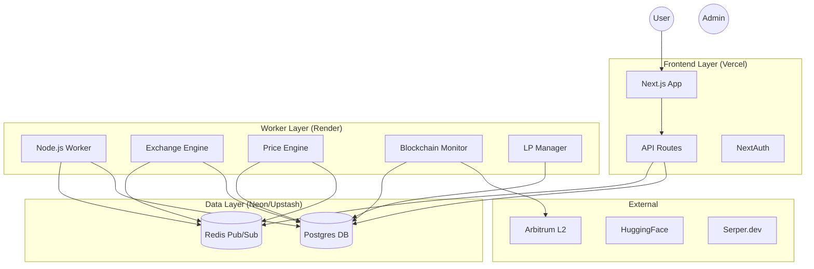
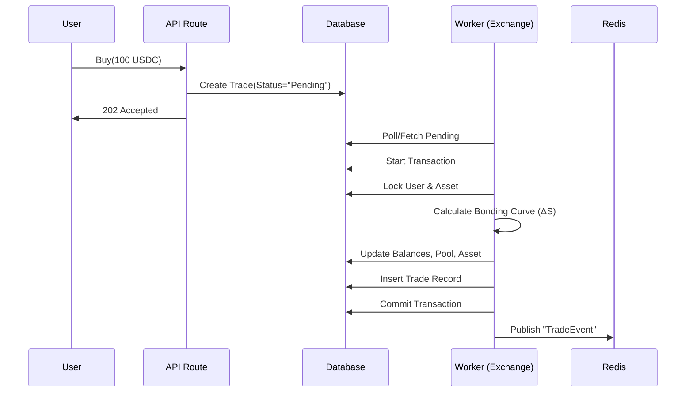
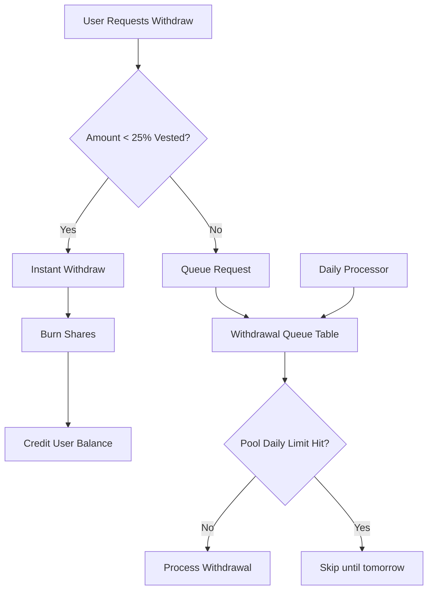

# Megatron Comprehensive Architecture & Status Guide

**Version**: 1.0 (Current State Analysis)
**Date**: 2025-12-09

## 1. System Architecture

The Megatron platform is designed as a **crypto-native synthetic exchange** using a **Monorepo** structure. It separates the user-facing application (Next.js) from the heavy-lifting logic (Node.js Worker) to ensure scalability and reliability.

### 1.1 High-Level Diagram

### 1.2 Core Data Flow Patterns

1.  **Atomic Trade Execution**:
    -   **Concept**: All state changes (User Balance, Pool Reserves, Asset Supply, Ledger) happen in a single ACID transaction.
    -   **Implementation**: `apps/worker/src/modules/exchange.ts` uses `db.$transaction` with `Serializable` isolation (or best effort) to prevent race conditions.
    -   **Why**: Prevents "double spend" and ensures the bonding curve mathematics always run on the latest state.

2.  **Event-Driven Pricing**:
    -   **Concept**: The Exchange does not calculate the *Display Price*. It only emits a `TradeEvent`.
    -   **Flow**: `Exchange` -> `Redis` ("trade_executed") -> `PriceEngine` -> `Calculates New Price` -> `Ably/Frontend`.
    -   **Why**: Decouples execution from analytics. High-frequency trading won't be blocked by complex price smoothing algorithms.

3.  **Two-Phase Deposit**:
    -   **Concept**: Deposits are not credited instantly.
    -   **Flow**:
        1.  `BlockchainMonitor` detects `Transfer` on Arbitrum.
        2.  Creates `PendingDeposit` (Status: "pending").
        3.  Waits for 12 confirmations.
        4.  Updates to `Confirmed` and writes to `Ledger` + `UserBalance` atomically.
    -   **Why**: Protects against chain reorgs and "fake" unconfirmed deposits.

---

## 2. Core Concepts & Choices

### 2.1 The Bonding Curve (Market Price)

We use a **Linear Bonding Curve**: $M(S) = P_0 + k \cdot S$.

*   **Choice**: Linear curves are simpler to audit and provide predictable liquidity depth compared to exponential curves.
*   **Math**:
    *   **Cost to Buy**: Integral of the price function. $\int_{S}^{S+\Delta S} (P_0 + kx) dx$.
    *   **Implementation**: `packages/lib-common/src/bondingCurve.ts`.
    *   **Logic**: We solve for $\Delta S$ given an input Amount $A$ using the quadratic formula.

### 2.2 LP Funding Model

*   **Concept**: Assets start in "Funding" state. They only transform to "Active" when a Soft Cap is reached.
*   **Choice**: This reduces risk. No trading occurs on "thin" liquidity.
*   **Mechanism**:
    *   Users contribute USDC -> Get LP Shares.
    *   `lp-manager.ts` checks `totalUsdc >= softCap`.
    *   **If Reached**: Status flips to `active`, trading enable.
    *   **Vesting**: LPs are locked. 25% unlocks after 1 week. This prevents "rug pulls" by early LPs.

---

## 3. Milestone Status (0-5)

Overview of the current implementation status against the Masterplan.

### ✅ Milestone 0: Project Setup
*   **Status**: **Complete**.
*   **Details**: Monorepo established (`apps/`, `packages/`), TypeScript config, ESLint, Prettier active.
*   **Missing**: None.

### ✅ Milestone 1: Data Model
*   **Status**: **Complete**.
*   **Details**: Prisma schema (`schema.prisma`) contains all 16 required models (`User`, `Asset`, `Trade`, `LPShare`, etc.). `DECIMAL(18,6)` precision utilized correctly.
*   **Missing**: Local seed data is basic, could be expanded for stress testing.

### ✅ Milestone 2: Authentication
*   **Status**: **Complete**.
*   **Details**: NextAuth.js configured with `CredentialsProvider`. `bcrypt` hashing verified. Setup for Google OAuth is present (feature flagged).
*   **Missing**: Email verification (not strictly required for MVP but good for anti-abuse).

### 🟡 Milestone 3: Bonding Curve Exchange
*   **Status**: **Mostly Complete (90%)**.
*   **Details**:
    *   `exchange.ts` implements the atomic buy logic perfectly.
    *   Logic handles Fees (0.5%) -> Split (90/10) -> LP Rewards.
*   **Missing**: 
    *   **Sell Logic**: `executeBuy` is implemented, `executeSell` needs to be verified or implemented if missing (file `exchange.ts` only showed `executeBuy` in my view - *Need to verify if `executeSell` exists further down*).
    *   **Slippage Protection**: The current `executeBuy` doesn't seem to take a `maxSlippage` or `minSharesOut` parameter.

### 🟡 Milestone 4: LP Mechanics
*   **Status**: **Mostly Complete (80%)**.
*   **Details**:
    *   `lp-manager.ts` handles contributions, fee claiming, and vesting checks.
    *   Withdrawal logic (Instant vs Queued) is implemented.
*   **Missing**:
    *   **Daily Global Limit**: The masterplan specifies "Max 10% of pool withdrawable per day". `withdrawal-processor.ts` processes requests but doesn't explicitly check a *global* rolling 24h limit on the pool itself, only per-user vesting limits.
    *   **Auto-Refund**: If Funding Deadline is missed, logic to auto-refund LPs is needed. `checkFundingDeadlines` job exists in `index.ts` but logic needs verification.

### ✅ Milestone 5: Blockchain & Custody
*   **Status**: **Complete**.
*   **Details**:
    *   `blockchain-monitor.ts` correctly scans for deposits and confirms them.
    *   `withdrawal-processor.ts` manages the hot wallet (`index 0`) to send USDC.
*   **Fixes Needed**:
    *   Hardcoded gas thresholds (`MIN_ETH_BALANCE`).
    *   Hardcoded `REQUIRED_CONFIRMATIONS`.

---

## 4. Immediate Next Steps (To Finalize M0-M5)

To fully satisfy Milestones 0-5 and prepare for M6 (Price Engine), strictly follow this checklist:

1.  **Implement `executeSell`**: Verify if it exists in `exchange.ts`. If not, implement it using `calculateSellRevenue` from `lib-common`.
2.  **Add Refusal Logic**: Update `exchange.ts` to accept `minSharesOut` (for buys) and `minUsdcOut` (for sells) to protect users from sandwhich attacks/slippage.
3.  **Global Withdrawal Limit**: Update `withdrawal-processor.ts` to track total withdrawals per pool per 24h window (using Redis key `withdraw:limit:{poolId}`) and reject/re-queue if >10% of TVL.
4.  **Funding Expiry Logic**: Implement the "Refund" logic in `checkFundingDeadlines` (if not already there). It needs to set status `cancelled` and allow LPs to withdraw 100% immediately.
5.  **Environment Config**: Move `12` confirmations and `0.001 ETH` thresholds to `.env`.

---

## 5. Visuals & Schemes

### 5.1 Trade Execution Sequence

### 5.2 LP Withdrawal Flow

